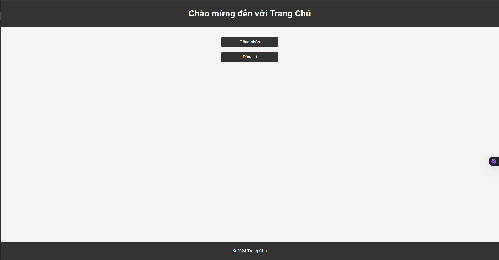
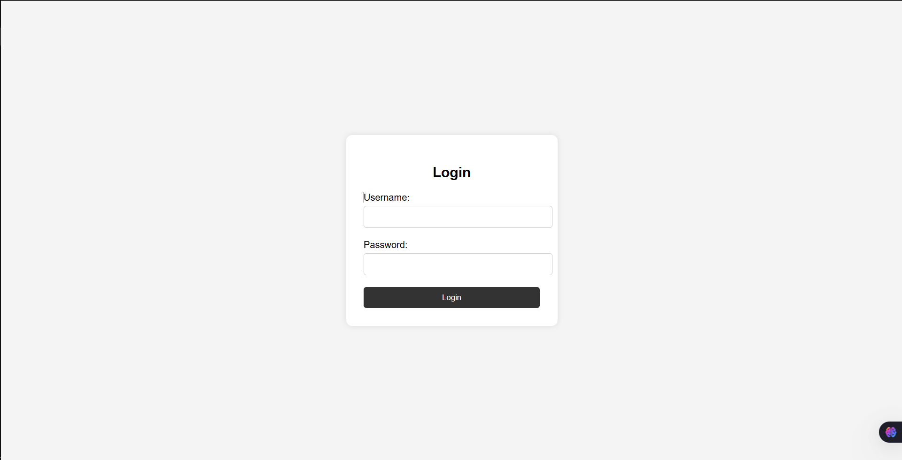
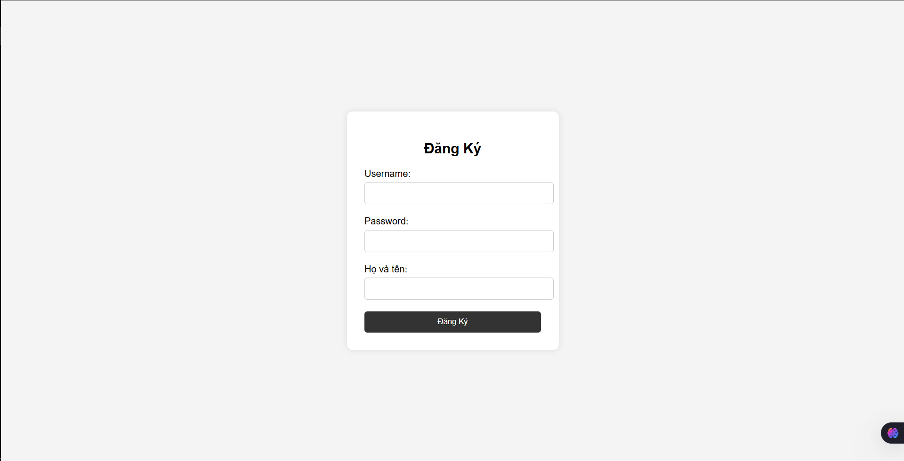
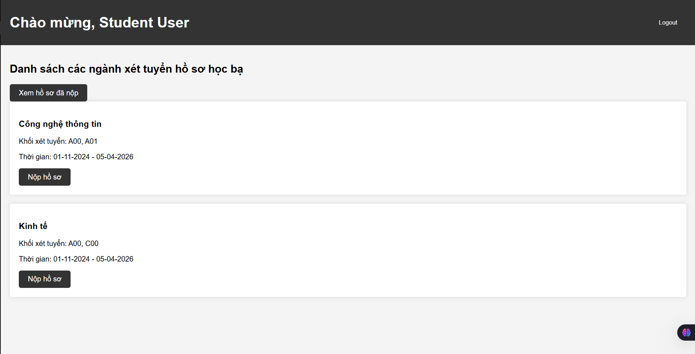
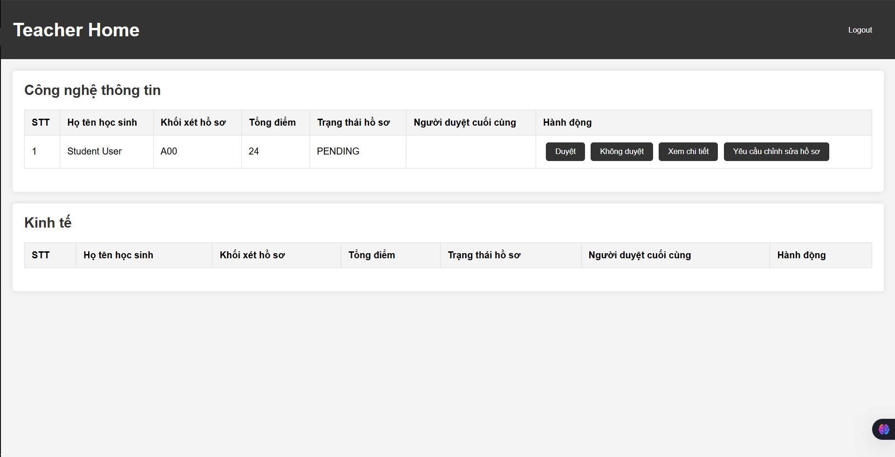
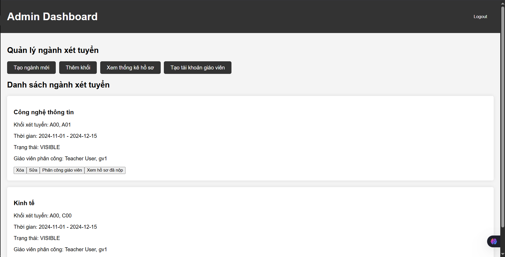

# Hệ Thống Quản Lý Tuyển Sinh Đại Học

## 📋 Mô tả dự án

Hệ thống quản lý tuyển sinh đại học là một ứng dụng web được phát triển bằng PHP, MySQL, giúp quản lý quy trình tuyển sinh từ việc đăng ký, nộp hồ sơ đến duyệt hồ sơ của các ứng viên.

## ✨ Tính năng chính

### 🎯 Dành cho Sinh viên (Student)

- Đăng ký tài khoản và đăng nhập
- Nộp hồ sơ xét tuyển cho các ngành học
- Chọn khối thi phù hợp (A00, A01, C00)
- Nhập điểm các môn thi
- Upload bảng điểm (hình ảnh)
- Xem trạng thái hồ sơ đã nộp
- Theo dõi kết quả xét tuyển

### 👨‍🏫 Dành cho Giảng viên (Teacher)

- Đăng nhập vào hệ thống
- Xem danh sách hồ sơ được phân công
- Duyệt/từ chối hồ sơ ứng viên
- Xem chi tiết thông tin hồ sơ
- Đưa ra nhận xét cho hồ sơ

### 👨‍💼 Dành cho Quản trị viên (Admin)

- Quản lý toàn bộ hệ thống
- Tạo và quản lý ngành học
- Thiết lập khối thi cho từng ngành
- Phân công giảng viên duyệt hồ sơ
- Quản lý tài khoản giảng viên
- Thống kê số liệu tuyển sinh
- Xem báo cáo tổng quan

## 🗂️ Cấu trúc dự án

```text
btck1/
│
├── index.php                 # Trang chủ
├── config.php               # Cấu hình hệ thống
├── database.sql             # File cơ sở dữ liệu
│
├── auth/                    # Xác thực người dùng
│   ├── login.php           # Đăng nhập
│   └── register.php        # Đăng ký
│
├── includes/               # Các file include
│   └── db.php             # Kết nối cơ sở dữ liệu
│
├── admin/                 # Module quản trị
│   ├── admin_dashboard.php    # Dashboard admin
│   ├── create_major.php      # Tạo ngành học
│   ├── edit_major.php        # Chỉnh sửa ngành học
│   ├── create_teacher.php    # Tạo tài khoản giảng viên
│   ├── assign_teachers.php   # Phân công giảng viên
│   ├── add_exam_block.php    # Thêm khối thi
│   ├── statistics.php        # Thống kê
│   ├── view_applications.php # Xem danh sách hồ sơ
│   └── view_application_details.php # Chi tiết hồ sơ
│
├── teacher/               # Module giảng viên
│   ├── teacher_home.php      # Trang chủ giảng viên
│   └── view_application_details.php # Duyệt hồ sơ
│
├── student/               # Module sinh viên
│   ├── home.php              # Trang chủ sinh viên
│   ├── apply.php            # Nộp hồ sơ
│   └── view_applications.php # Xem hồ sơ đã nộp
│
└── uploads/               # Thư mục lưu file upload
    └── [các file bảng điểm]
```

## 🗄️ Cơ sở dữ liệu

Hệ thống sử dụng MySQL với các bảng chính:

- **users**: Quản lý tài khoản người dùng (Admin, Teacher, Student)
- **majors**: Thông tin các ngành học
- **exam_blocks**: Các khối thi (A00, A01, C00)
- **applications**: Hồ sơ xét tuyển của sinh viên
- **teacher_assignments**: Phân công giảng viên duyệt hồ sơ
- **statistics**: Thống kê tuyển sinh

## 🛠️ Cài đặt và triển khai

### Yêu cầu hệ thống

- PHP 7.4 trở lên
- MySQL 5.7 trở lên
- Apache/Nginx web server
- XAMPP/WAMP (cho môi trường development)

### Hướng dẫn cài đặt

1. **Clone repository**

   ```bash
   git clone [URL_REPOSITORY]
   cd btck1
   ```

2. **Cài đặt cơ sở dữ liệu**
   - Tạo database mới trong MySQL
   - Import file `database.sql` vào database vừa tạo

   ```sql
   mysql -u [username] -p [database_name] < database.sql
   ```

3. **Cấu hình kết nối database**
   - Chỉnh sửa file `includes/db.php`
   - Cập nhật thông tin kết nối database:

   ```php
   $servername = "localhost";
   $username = "your_username";
   $password = "your_password";
   $dbname = "your_database_name";
   ```

4. **Thiết lập quyền thư mục**

   ```bash
   chmod 755 uploads/
   ```

5. **Truy cập ứng dụng**
   - Mở trình duyệt và truy cập: `http://localhost/btck1`

## 👥 Tài khoản mặc định

Hệ thống được tạo sẵn các tài khoản test:

| Loại tài khoản | Username | Password | Mô tả |
|---------------|----------|----------|--------|
| Admin | admin_user | 123456 | Quản trị viên |
| Teacher | teacher_user | 123456 | Giảng viên |
| Student | student_user | 123456 | Sinh viên |

> ⚠️ **Lưu ý**: Đổi mật khẩu mặc định trước khi triển khai production

## 🔧 Khối thi và môn học

Hệ thống hỗ trợ các khối thi:

- **A00**: Toán, Lý, Hóa
- **A01**: Toán, Lý, Anh
- **C00**: Văn, Sử, Địa

## 📸 Ảnh minh họa giao diện

### 🏠 Trang chủ



### 🔐 Đăng nhập



### 📝 Đăng ký



### 👨‍🎓 Giao diện sinh viên



### 👨‍🏫 Giao diện giảng viên



### 👨‍💼 Giao diện quản trị viên



### 📋 Mô tả các giao diện

| Giao diện | Mô tả | Chức năng chính |
|-----------|-------|-----------------|
| **Trang chủ** | Giao diện đầu tiên người dùng thấy | Đăng nhập, đăng ký |
| **Đăng nhập** | Form xác thực người dùng | Nhập username/password, phân quyền |
| **Đăng ký** | Form tạo tài khoản mới | Tạo tài khoản sinh viên |
| **Sinh viên** | Dashboard dành cho sinh viên | Nộp hồ sơ, xem kết quả |
| **Giảng viên** | Dashboard dành cho giảng viên | Duyệt hồ sơ, đánh giá |
| **Quản trị viên** | Dashboard dành cho admin | Quản lý toàn bộ hệ thống |

## 🤝 Đóng góp

1. Fork dự án
2. Tạo branch mới (`git checkout -b feature/AmazingFeature`)
3. Commit thay đổi (`git commit -m 'Add some AmazingFeature'`)
4. Push lên branch (`git push origin feature/AmazingFeature`)
5. Tạo Pull Request

## 📝 Giấy phép

Dự án này được phát hành dưới giấy phép MIT. Xem file `LICENSE` để biết thêm chi tiết.

## 📞 Liên hệ

- **Email**: [luuconghn.lamcong.contacts@gmail.com]
- **Phone**: [0796049711]
- **GitHub**: [luuconghoangnam]

## 🔄 Phiên bản

- **v1.0.0** - Phiên bản đầu tiên
  - Đăng ký/đăng nhập
  - Nộp hồ sơ xét tuyển
  - Duyệt hồ sơ
  - Quản lý ngành học
  - Thống kê cơ bản

## 🐛 Báo lỗi

Nếu bạn phát hiện lỗi, vui lòng tạo issue mới trên GitHub với thông tin chi tiết về lỗi và cách tái hiện.

## 📈 Tính năng sắp tới

- [ ] Gửi email thông báo kết quả
- [ ] Xuất báo cáo PDF
- [ ] API RESTful
- [ ] Giao diện responsive
- [ ] Tích hợp thanh toán phí xét tuyển
- [ ] Hệ thống chat hỗ trợ

---

⭐ **Đừng quên star repository nếu bạn thấy dự án hữu ích!**
